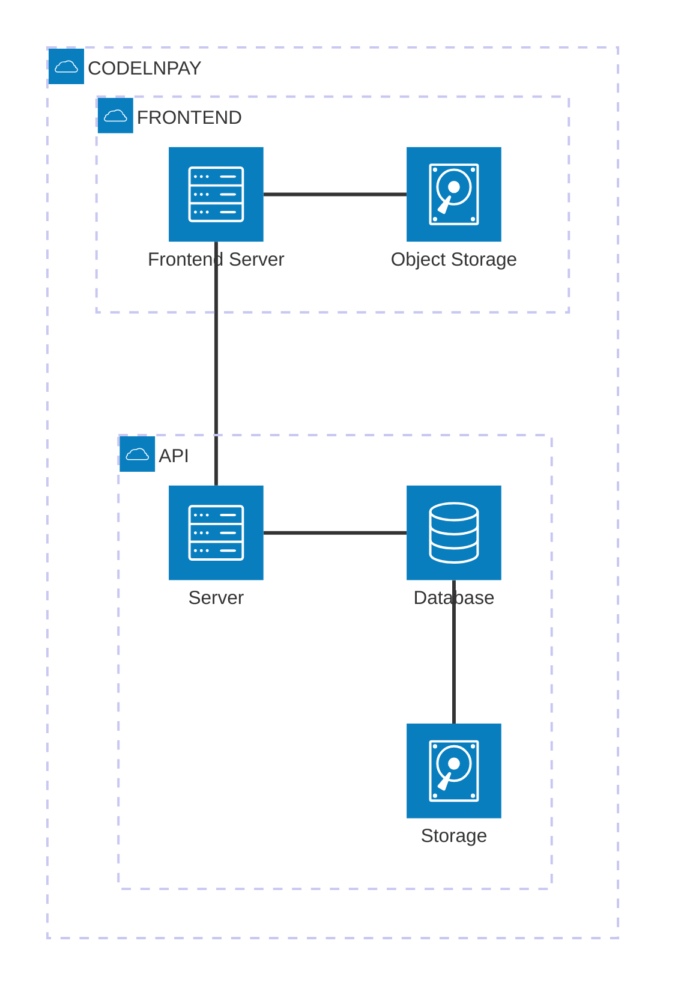
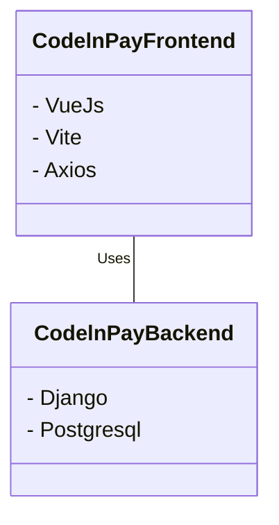

## CodelnPay

### Note for SCF:

Due to the nature of the data that CodelnPay handles, being sensitive data including but not limited to customer information, 
financial records, or personal identifier information, the Codeln Organisation maintains private code repositories. 

CodelnPay Frontend Code has been included in the project to demonstrate project development progress. 
However the backend repo is shown  below.
You can request access using the following email : philisiah@codeln.com.

### CodelnPay Architechture

[//]: # (![CodelnPay-Architechture-Diagram])
### Backend Repo Image
![backend-repo-image]

Additionally, here are the links to the CodelnPay product.

* [Codeln Pay](https://pay.codeln.com)

Use this email [info@codeln.com] above to contact us for further details.

## About The Project

#### Codeln Pay is a crypto payroll payment solution designed to facilitate cross-border transactions for businesses and remote workers.

#### With robust security features, Codeln Pay ensures that all transactions are encrypted and protected, giving users peace of mind.

#### Payments are delivered instantly and at an affordable charge.

#### Key features include support for multiple payment methods, including digital wallet, credit cards, and bank transfers.

<!-- ABOUT THE PROJECT -->

[![Product Name Screen Shot][product-screenshot]](https://pay.codeln.com)

### Built With

### Backed By

* <a href="https://stellar.org/"></img></a>

[React.js]: https://img.shields.io/badge/React-20232A?style=for-the-badge&logo=react&logoColor=61DAFB

[React-url]: https://reactjs.org/

[Vue.js]: https://img.shields.io/badge/Vue.js-35495E?style=for-the-badge&logo=vuedotjs&logoColor=4FC08D

[Vue-url]: https://vuejs.org/

[Angular.io]: https://img.shields.io/badge/Angular-DD0031?style=for-the-badge&logo=angular&logoColor=white

[Angular-url]: https://angular.io/

[Stellar.io]: https://cdn.sanity.io/images/e2r40yh6/production-i18n/40c30d9139a96e08606c1d12dc31697649642862-1667x1000.png?w=1224&auto=format&dpr=2

[Stellar-url]:  https://stellar.org/

[Django.org]: https://static.djangoproject.com/img/logos/django-logo-positive.png

[Django-url]:  https://www.djangoproject.com
[CodelnPay-Architechture-Diagram]:  images/product_screenshot.png
[backend-repo-image]: images/backend_repo_image.png

[product-screenshot]: images/product_screenshot.png

<!-- CONTACT -->

## Contact

Codeln Team - [@Codeln_spaces](https://twitter.com/Codeln_spaces) - info@codeln.com

<!-- NOTE -->

### Note:

CodelnPay handles sensitive data including but not limited to customer information, financial records, or personal
details,
hence the project maintains private code repositories. Use the email above to contact us for further details.
