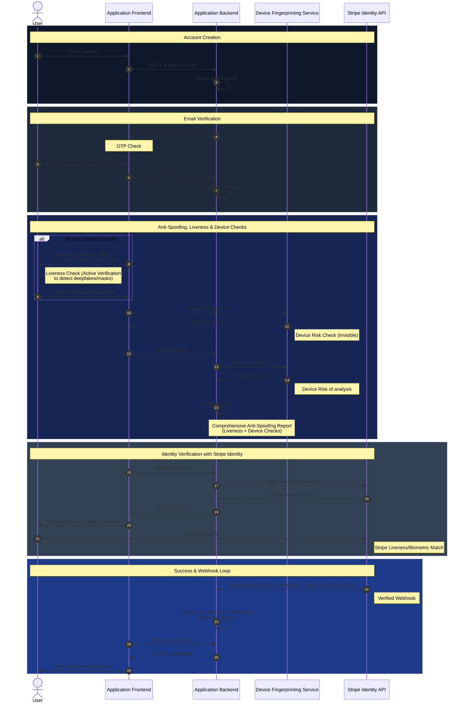

```mermaid
sequenceDiagram
    autonumber
    actor User as User
    participant FE as Application Frontend
    participant BE as Application Backend
    participant Fingerprint as Device Fingerprinting Service
    participant Stripe as Stripe Identity API

    %% SECTION 1: Account Creation (Deep Dark Blue/Black)
    rect rgb(15, 23, 42)
        Note over User, Stripe: Account Creation
        User->>FE: Enters details
        FE->>BE: POST is pending user
        BE->>BE: Create pending user
    end

    %% SECTION 2: Email Verification (Dark Navy)
    rect rgb(30, 41, 59)
        Note over User, Stripe: Email Verification
        BE-->>FE: Triggers OTP Service (Send code)
        Note over FE: OTP Check
        User->>FE: Enters OTP
        FE->>BE: Send OTP
        BE->>BE: Mark email verified
    end

    %% SECTION 3: Anti-Spoofing, Liveness & Device Checks (Electric Midnight Blue)
    rect rgb(23, 37, 84)
        Note over User, Stripe: Anti-Spoofing, Liveness & Device Checks
        
        alt Active Liveness Check
            FE->>User: Request Liveness Check<br/>(e.g., Blink, Smile, Turn Head)
            Note left of FE: Liveness Check (Active Verification<br/>to detect deepfakes/masks)
            User->>FE: Performs required movement
        end

        FE->>Fingerprint: Request fingerprint
        Fingerprint-->>FE: Return fingerprint
        Note right of Fingerprint: Device Risk Check (Invisible)
        FE->>BE: Send fingerprint
        BE->>Fingerprint: Request analysis
        Fingerprint-->>BE: Return risk score
        Note right of Fingerprint: Device Risk of analysis
        BE->>BE: Verify low risk
        Note over BE, Fingerprint: Comprehensive Anti-Spoofing Report<br/>(Liveness + Device Checks)
    end

    %% SECTION 4: Identity Verification with Stripe Identity (Steel Blue/Dark Slate)
    rect rgb(51, 65, 85)
        Note over User, Stripe: Identity Verification with Stripe Identity
        FE->>BE: Request session
        BE->>Stripe: Create VerificationSession
        Stripe-->>BE: Return client_secret
        BE-->>FE: Return secret
        FE->>User: Redirect User to Stripe verification
        User->>Stripe: Upload ID/selfie
        Note right of Stripe: Stripe Liveness/Biometric Match
    end

    %% SECTION 5: Success & Webhook Loop (Deep Royal Blue)
    rect rgb(30, 58, 138)
        Note over User, Stripe: Success & Webhook Loop
        Stripe->>BE: Asynchronous identity.verification_session.verified webhook
        Note right of Stripe: Verified Webhook
        BE->>BE: Update user status to verified: true<br/>Unlock app access
        FE->>BE: Poll Backend status
        BE-->>FE: Confirm verification
        FE->>User: Show Welcome Dashboard
    end
```