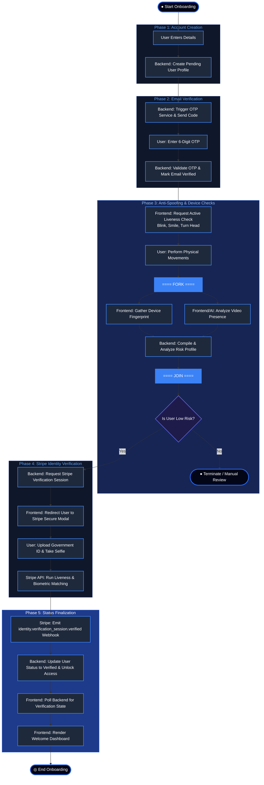

```mermaid
graph TD
    %% Theme Styling (Black & Blue Theme)
    classDef startEnd fill:#020617,stroke:#2563eb,stroke-width:3px,color:#fff;
    classDef action fill:#1e293b,stroke:#3b82f6,stroke-width:2px,color:#fff;
    classDef decision fill:#1e1b4b,stroke:#6366f1,stroke-width:2px,color:#fff;
    classDef forkJoin fill:#3b82f6,stroke:#3b82f6,stroke-width:4px,color:#fff;

    %% Entry Point
    Start([● Start Onboarding]) --> EnterDetails
    class Start startEnd;

    %% SECTION 1: ACCOUNT CREATION
    subgraph Account_Creation [Phase 1: Account Creation]
        EnterDetails[User Enters Details]:::action
        CreatePending[Backend: Create Pending User Profile]:::action
        
        EnterDetails --> CreatePending
    end
    style Account_Creation fill:#0f172a,stroke:#1e3a8a,stroke-width:1px,color:#60a5fa

    %% SECTION 2: EMAIL VERIFICATION
    subgraph Email_Verification [Phase 2: Email Verification]
        CreatePending --> TriggerOTP[Backend: Trigger OTP Service & Send Code]:::action
        TriggerOTP --> EnterOTP[User: Enter 6-Digit OTP]:::action
        EnterOTP --> VerifyEmail[Backend: Validate OTP & Mark Email Verified]:::action
    end
    style Email_Verification fill:#0f172a,stroke:#1e3a8a,stroke-width:1px,color:#60a5fa

    %% SECTION 3: ANTI-SPOOFING & DEVICE CHECKS
    subgraph Anti_Spoofing [Phase 3: Anti-Spoofing & Device Checks]
        VerifyEmail --> RequestLiveness[Frontend: Request Active Liveness Check<br/>Blink, Smile, Turn Head]:::action
        RequestLiveness --> PerformMovement[User: Perform Physical Movements]:::action
        
        %% Forking into parallel background checks
        PerformMovement --> Fork1[==== FORK ====]:::forkJoin
        
        Fork1 --> GetFingerprint[Frontend: Gather Device Fingerprint]:::action
        Fork1 --> AnalyzeLiveness[Frontend/AI: Analyze Video Presence]:::action
        
        GetFingerprint --> SendRiskData[Backend: Compile & Analyze Risk Profile]:::action
        AnalyzeLiveness --> SendRiskData
        
        %% Join and evaluate
        SendRiskData --> Join1[==== JOIN ====]:::forkJoin
        Join1 --> EvalRisk{Is User Low Risk?}:::decision
        
        EvalRisk -- No --> Terminate([● Terminate / Manual Review])
        class Terminate startEnd;
    end
    style Anti_Spoofing fill:#172554,stroke:#2563eb,stroke-width:1px,color:#93c5fd

    %% SECTION 4: STRIPE IDENTITY VERIFICATION
    subgraph Stripe_Identity [Phase 4: Stripe Identity Verification]
        EvalRisk -- Yes --> ReqSession[Backend: Request Stripe Verification Session]:::action
        ReqSession --> RedirectStripe[Frontend: Redirect User to Stripe Secure Modal]:::action
        RedirectStripe --> UploadDocs[User: Upload Government ID & Take Selfie]:::action
        UploadDocs --> StripeProcessing[Stripe API: Run Liveness & Biometric Matching]:::action
    end
    style Stripe_Identity fill:#0f172a,stroke:#1e3a8a,stroke-width:1px,color:#60a5fa

    %% SECTION 5: SUCCESS & LOOP
    subgraph Success_Loop [Phase 5: Status Finalization]
        StripeProcessing --> StripeWebhook[Stripe: Emit identity.verification_session.verified Webhook]:::action
        StripeWebhook --> UpdateDB[Backend: Update User Status to Verified & Unlock Access]:::action
        
        %% Frontend polling loop
        UpdateDB --> PollStatus[Frontend: Poll Backend for Verification State]:::action
        PollStatus --> Dashboard[Frontend: Render Welcome Dashboard]:::action
    end
    style Success_Loop fill:#1e3a8b,stroke:#3b82f6,stroke-width:1px,color:#fff

    %% Exit Point
    Dashboard --> EndNode([◎ End Onboarding])
    class EndNode startEnd;
```