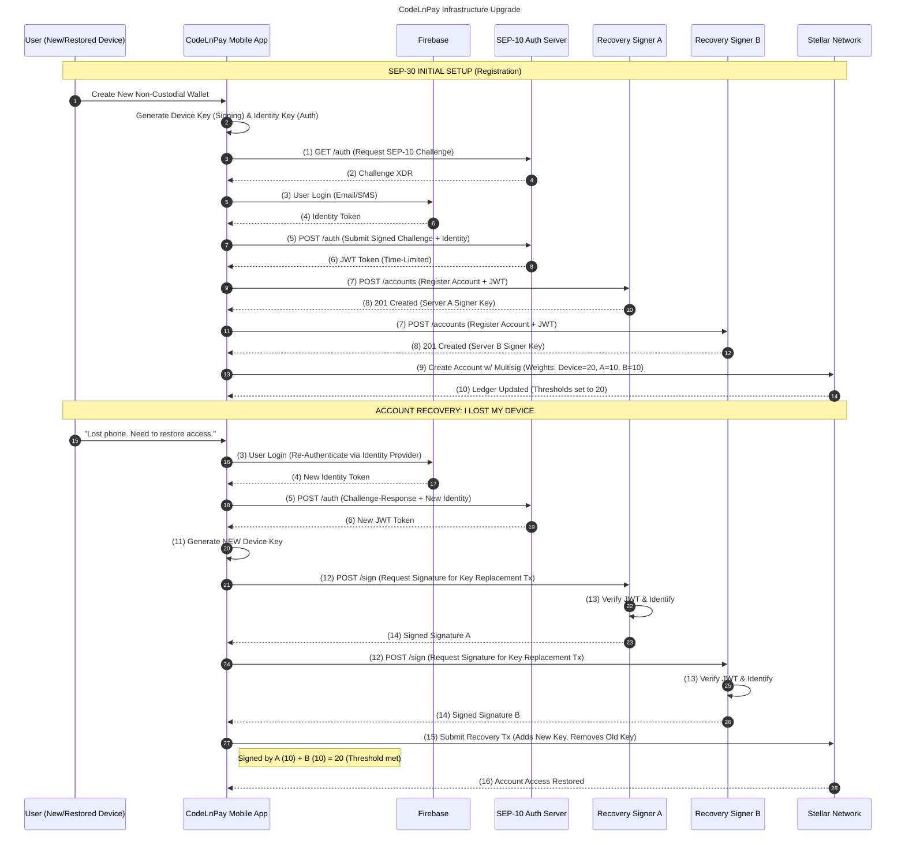
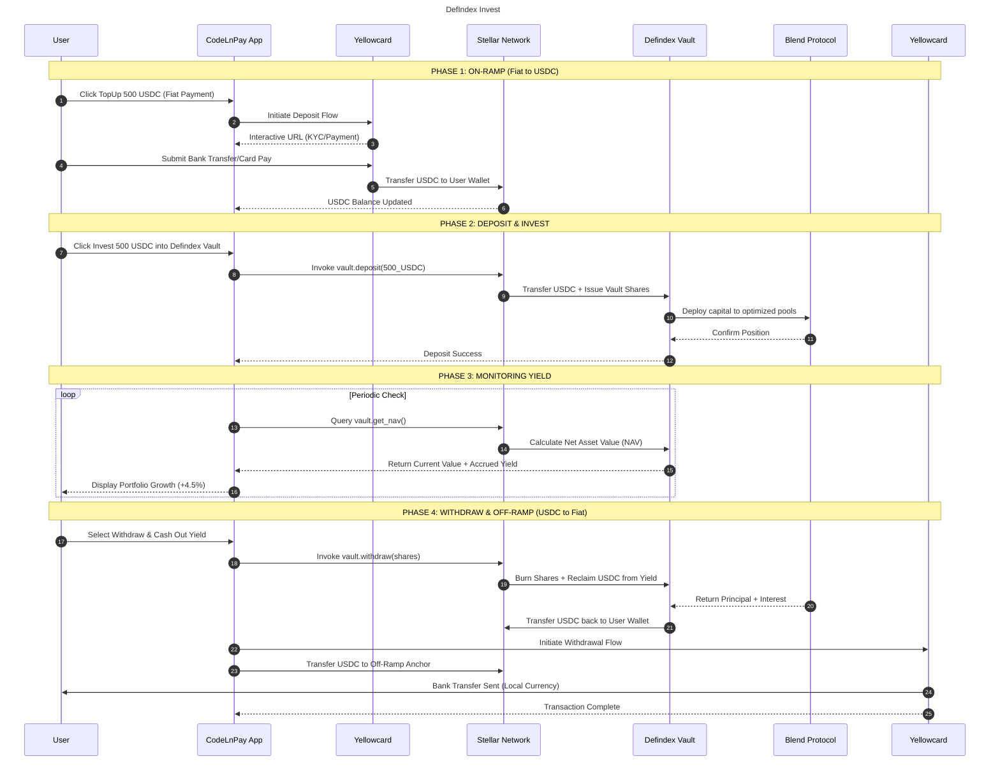

## CodeLnPay Architecture : Stellar SCF<br>

### Overview<br>

CodeLn Pay is a Web3-powered payroll platform that facilitates seamless cross-border salary payments.

We enable employers in the U.S., Canada, United Kingdom, and Europe to efficiently pay their remote employees and
contractors based anywhere in Africa.

CodeLnPay solution is a full-featured a stellar wallet, allowing users to unlock the ability to receive USDC Stablecoin
Salary Payments. With notable on-ramp and off-ramp integrations with stellar ecosystem partners like YellowCard,
LinkIO and OnrampMoney.

### <u>SCF Integration Submission: CodeLnPay Yield Generation with DeFiIndex</u><br>

This submission seeks to address two implementations for CodeLnPay
<ol>
<li><em><strong>Wallet Recovery using Stellar's SEP30 Protocol.</strong></em> SEP30 provides a unique opportunity for CodeLnPay to improve the
   usability
   of our Stellar Wallet.</li>
<li><em><strong>Yield Generation using DeFindex.</strong></em>Users will be able to interact with CodeLnPay's Yield vault via CodeLnPay's
   Mobile and Web Application to invest and earn Salaries left sitting in their wallets.
</li>
</ol>

#### <u>High Level Architechture Diagram</u><br>

![high-level-arch]

#### <u>Wallet Recovery using Stellar's SEP30 Protocol</u><br>

##### Overview

Implementing the SEP-30 standard, will allow users to regain access to their accounts using familiar identity providers (
Email/SMS).

###### Flow & Logic<br>

The architecture utilizes a 2-of-3 Multi-Signature configuration.
To authorize the rotation of a lost key, at least two signatures are required.

###### Enrollment & Recovery Sequence Diagram<br>



###### Component Specifications

1. Identity Layer (Firebase Auth)
   CodeLnPay utilizes Firebase Authentication as the gatekeeper for recovery requests. Authentication Factors are SMS
   /Email OTP. A recovery server will only interact with AWS KMS if the user presents a valid, short-lived Firebase
   Identity Token.

2. Recovery Signers (SEP-30)
   The recovery logic is split between two geographically and logically isolated servers:
    - Server A (Primary): Managed by CodeLnPay. It validates the user's identity token and requests a signature from its
      dedicated AWS KMS key.
    - Server B (Backup): Acts as a redundant safety measure. In a "lost device" scenario, both Server A and Server B
      sign a transaction to rotate the user's master key to a new device.
    - Hardware Security: All keys are stored in AWS KMS (ECC_ED25519). Keys are generated inside the HSM and can
      never be exported or viewed by anyone.
3. Stellar Account Configuration
   Upon onboarding, the user's Stellar account is configured with specific weights:
    - Master Key (User Device): Weight 10
    - Recovery Signer A: Weight 5
    - Recovery Signer B: Weight 5
    - Thresholds: Low/Med/High = 10.
    - The user can transact alone (10), but recovery requires both A + B (5 + 5) to meet the threshold.

###### API Specification : Recovery Server A & B

Recovery server A & B expose an identical interface for the CodeLnpay Mobile Client.

1. Base Configuration
    - Protocol: HTTPS
    - Authentication: Firebase ID Token (JWT) passed in the Authorization header.
    - Content-Type: application/json
2. Endpoint: POST /accounts/{address}/signers
   This endpoint is used during the Onboarding Phase.
   The user registers their recovery intent with the server.

   | Method | Endpoint                    | Description                                                              |
   |:-------|:----------------------------|:-------------------------------------------------------------------------|
   | POST   | /accounts/{address}/signers | Registers the server as a recovery signer for a specific Stellar address |

3. Endpoint: POST /accounts/{address}/sign
   Recovery Phase endpoint. It is called when a user has lost their device and needs the server to sign a transaction (
   XDR) to rotate their keys.

   | Method | Endpoint                 | Description                                                   |
   |:-------|:-------------------------|:--------------------------------------------------------------|
   | POST   | /accounts/{address}/sign | Requests a signature from the AWS KMS-backed recovery server. |

4. Server Logic (Server A & B)
    - Validate JWT: Verify the Firebase token matches the registered auth_method for {address}.
    - XDR Inspection: Ensure the transaction only contains operations for set_options (key rotation). The server must
      reject any transaction attempting to move funds.
    - KMS Signing: Send the transaction hash to AWS KMS for signing using the ECC_ED25519 key.
    - Return Signature: Append the signature to the response.

##### Security  Check Specifications

1. XDR Inspection
    - Operation Whitelisting: Payment, PathPayment, and CreateAccount operations are strictly forbidden
    - Source Account Verification: Ensure the source_account in the transaction matches the Stellar address associated
      with the user's authenticated Firebase UID
    - Memo Inspection
    - Example Code:
       ```python
            import boto3
            from botocore.exceptions import ClientError
            import logging
            from django.http import JsonResponse
            from stellar_sdk import TransactionEnvelope, Operation
            import base64
            
            KMS_KEY_ID = "alias/codelnpay-recovery-signer-a" 
            AWS_REGION = "region-1"
            
            def sign_with_kms(transaction_hash: bytes) -> bytes:
            
                client = boto3.client('kms', region_name=AWS_REGION)
            
                try:
                    response = client.sign(
                        KeyId=KMS_KEY_ID,
                        Message=transaction_hash,
                        MessageType='DIGEST', 
                        SigningAlgorithm='ECDSA_SHA_256' 
                    )        
                    return response['Signature']
                except ClientError as e:
                    logging.error(f"KMS Signing Error: {e.response['Error']['Message']}")
                    raise Exception("Failed to generate hardware signature.")
       
        
            
            def inspect_and_sign_recovery(request):
                """
                Validates that a transaction ONLY contains recovery-related operations.
                """
                data = request.POST or request.json() 
                xdr = data.get("transaction_xdr")
                
                    try:
                        envelop = TransactionEnvelope.from_xdr(xdr, network_passphrase="Public Global Stellar Network ; September 2015")
                        tx = envelop.transaction
                
                        ALLOWED_OPS = (Operation.SetOptions,)
                
                        for op in tx.operations:
                            if not isinstance(op, ALLOWED_OPS):
                                return JsonResponse({
                                    "error": f"Security Violation: Operation {type(op).__name__} is forbidden in recovery flow."
                                }, status=403)
                            if isinstance(op, Operation.SetOptions):
                                pass
                        signature = sign_with_kms(tx.hash()) 
                        return JsonResponse({"status": "verified", "message": "XDR safe for signing"})
                
                    except Exception as e:
                        return JsonResponse({"error": f"Invalid XDR: {str(e)}"}, status=400)
                
                
       ```

### <u>Yield Generation using DeFindex</u><br>

#### Overview<br>

The DeFindex Vault acts as the decentralized fund manager. CodeLnPay interacts with the vault through the DeFindex SDK.

###### Flow & Logic<br>

This integration follows a three tier integration.

1. On-Chain Layer: DeFindex Vault Smart Contract & Strategy Adapters (e.g., for Blend)
2. Middleware Layer : Orchestrates transaction building, sponsorship, and indexation of vault events.
3. Client Layer (CodeLnPay Mobile & Web): Provides the UI for deposit, withdrawal, and real-time yield tracking.

###### Sequence Diagram<br>



###### Component Specifications<br>

1. On-Chain Layer: DeFindex Vault Smart Contract.
   CodeLnPay Backend will interact with the following vault functions.

   | Function    | Description                                                   |
   |:------------|:--------------------------------------------------------------|
   | deposit     | Mints shares to the user in exchange for underlying assets (USDC). |
   | withdraw    | Burns shares and returns the proportional amount of underlying assets (USDC). |
   | get_balance | Returns the user’s specific share balance and underlying value. |

2. Middleware Layer: Implements DeFindex SDK.
   In addition to facilitating transactions, the middleware provides interactions to obtain performance metrics based on
   users wallets.
3. Client Layer (CodeLnPay Mobile & Web).
   CodeLnPay mobile will provide seamless, minimal click deposit experience for users, as well as providing a visual
   representation of vault performance.

[high-level-arch]: images/high_lvl_arch_diag.png
