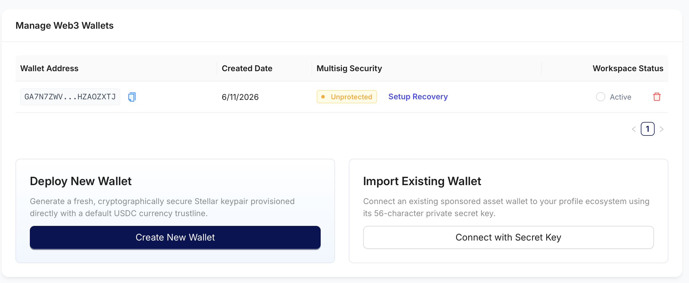
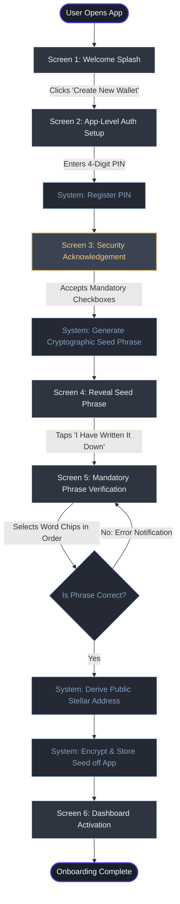
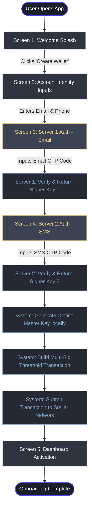
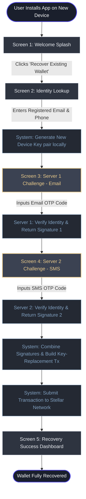

## Phase 2: UX Recovery Process

### Overview

In this phase, the CodeLnPay Onboarding Infrastructure is upgraded to natively support automated recovery signer setup,
successfully transitioning the platform from a single-point-of-failure storage model to a decentralized recovery framework.
This infrastructure overhaul completely removes the user-experience friction and operational risks associated with manual seed phrase management. 
In its place, CodeLnPay deploys a secure, on-chain multi-signature threshold matrix that abstracts complexity away from the 
user while enforcing strict security boundaries. 
At the moment of registration, the CodeLnpay coordinates with the recovery servers to establish multi-party signing authorization.
#### Core Architectural Enhancements:
1. Decentralized Identity Anchoring: Rather than forcing users to secure physical paper backups, account recovery capability is bound securely to verified, out-of-band identity protocols (Email and SMS One-Time Passwords) processed directly by isolated recovery servers. 
2. Algorithmic Threshold Enforcement: The system automatically configures the Stellar account's signing matrix during initialization. By tuning  operation weights (assigning a dominant weight to the local device key and secondary weights to individual recovery servers), the local device handles day-to-day transaction signing seamlessly on its own. 
3. Collusion-Resistant Recovery: The threshold configuration ensures that no single recovery server—nor CodeLnPay itself—can unilaterally recovery an account key. A quorum of independent signatures is strictly required only during the master key replacement flow.

Included in this doc are diagrams that detail the end-to-end registration sequences for both onboarding models. 
They map out the precise user interface interactions alongside the behind-the-scenes system actions that were required 
to transition from a legacy, single-key local backup to CodeLnPay's secure, 
identity-verified multi-signature threshold configuration.
 
 
#### How to test (Staging Only: USE OTP, EMAIL and VERIFICATION CODE AS 123456)
1. Navigate to [CodelnPay Staging Manage Wallet ](https://pearlmine-94bec.web.app/Wallet)
- User : stellartest@cdln.com
- Password : biwrupgozxob8mojTy
- OTP : 123456
 
 
2. Create New Wallet
![manage-wallet-image]
 
 
3. SetUp recovery

 
 
4. NOTE: Recover Wallet - USE 123456 for both EMAIL and SMS CODE [Staging Only]
 
 
#### Diagram 1: Onboarding with Seed Phrase Generation

#### Diagram 2: Onboarding with SEP30 Recovery Server SetUp

#### Diagram 3: Wallet Recovery UX Flow for a New Device Scenario

### Wallet SetUp and Recovery Demo

[manage-wallet-image]: images/manage_wallets.png
[recover-wallet-image]: images/recover_wallet.png
